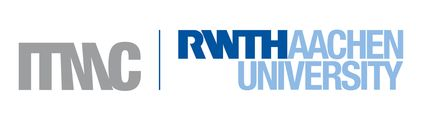

### Machine learning approaches for the prediction of oxygen evolution catalysts.

#### Dr. Stefan Palkovits

#### <stefan.palkovits@itmc.rwth-aachen.de>

#### [\@PalkovitsLab](https://twitter.com/palkovitslab)

---

An online version of this talk can be found in this reporsitory:

[REAKT2019_ML4OER_SPks.ipynb](https://github.com/spalkovits/REAKT2019_ML4OER_SPks/blob/master/REAKT2019_ML4OER_SPks.ipynb)

If you like to follow along this talk click the Colab button above. It works best when you choose "Open in new tab" or "Open in new window". You will need Google credentials for full functionality.

This talk uses **Jupyter Notebooks**.

As the scope of this notebook is a talk the code will not be commented. Questions are very welcome.
